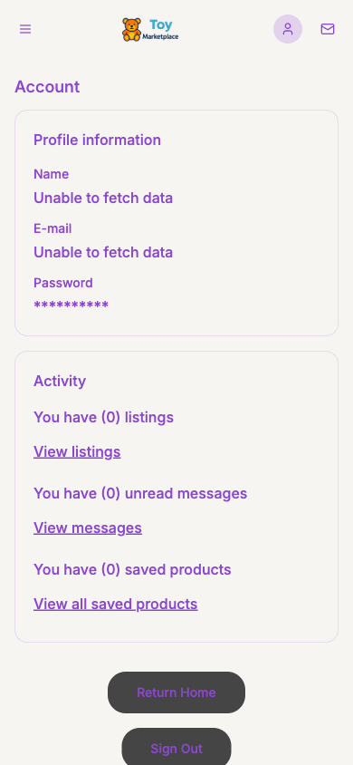
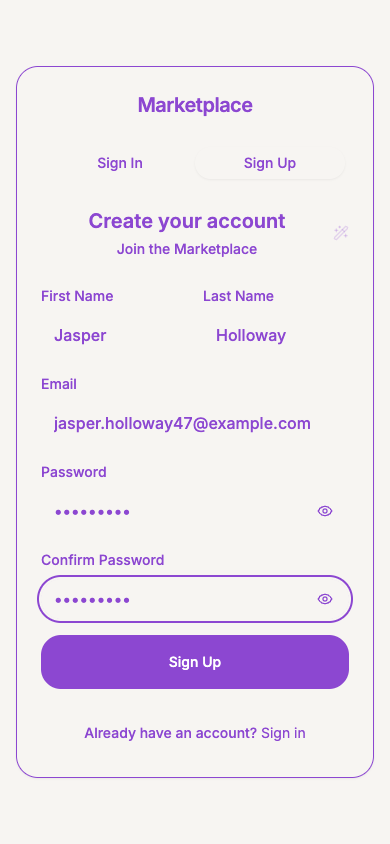
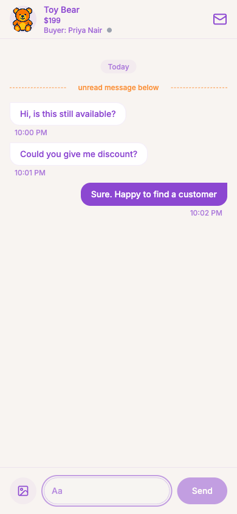
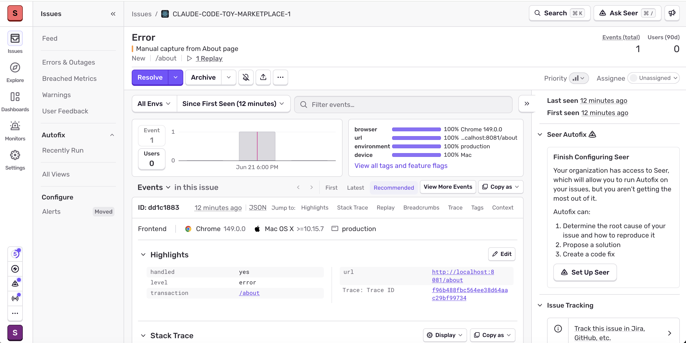
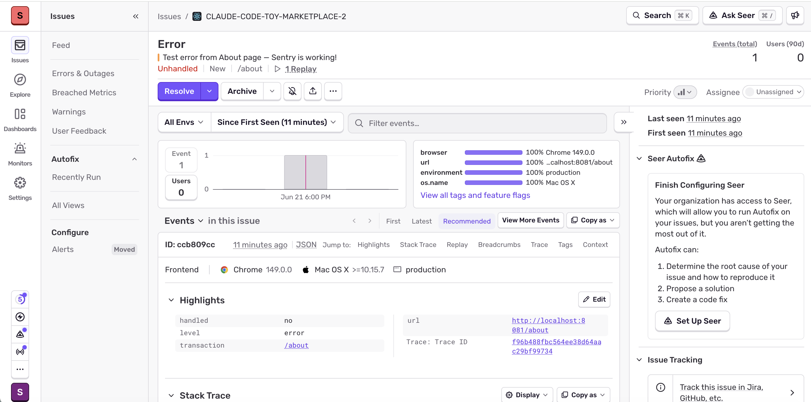
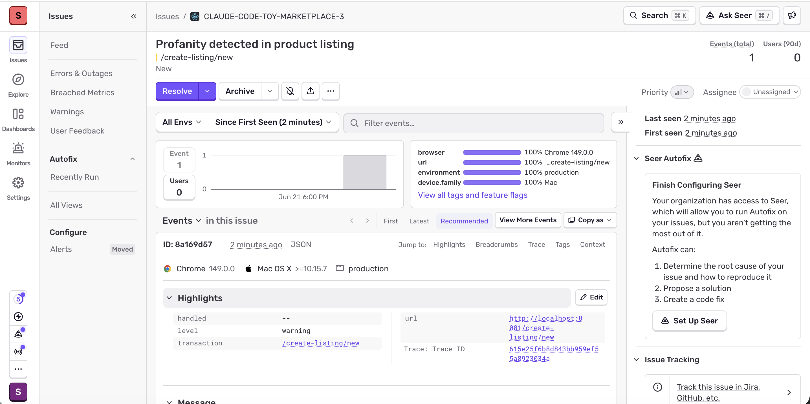
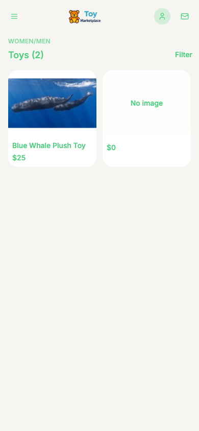

# claude_code_toy_marketplace

A mobile-first toy marketplace SPA built with React 18 + TypeScript + Vite + Supabase.



---

## MCP Servers

This project uses [Model Context Protocol (MCP)](https://modelcontextprotocol.io) servers to give Claude Code live browser control and up-to-date library documentation during development sessions.

### Configuration

MCP servers are declared in `.mcp.json` at the project root (gitignored — credentials stay local). Copy `.mcp.json.example` and fill in your values:

```bash
cp .mcp.json.example .mcp.json
# edit .mcp.json with your API keys and project refs
```

### Playwright

**Package:** `@playwright/mcp@latest`  
**Purpose:** Gives Claude Code a real browser it can drive — navigate pages, click, type, upload files, take screenshots, and assert UI state.

```json
{
  "playwright": {
    "command": "npx",
    "args": ["-y", "@playwright/mcp@latest", "--browser", "chrome"]
  }
}
```

Used in this project to:
- Take mobile-viewport screenshots (iPhone 12 Pro 390×844) at each development milestone
- Run end-to-end flows: sign up, create listings, send messages, verify realtime chat
- Upload product images via the file chooser during listing creation
- Verify UI changes (e.g., theme color swap from blue to purple) before committing

Playwright MCP sessions write page-state snapshots to `.playwright-mcp/` (gitignored).

### Context7

**Transport:** HTTP (`https://mcp.context7.com/mcp`)  
**Purpose:** Serves current library documentation (React, Supabase, TanStack Query, Vite, shadcn/ui, etc.) directly into Claude Code's context so answers reflect the actual installed versions, not training-data snapshots.

```json
{
  "context7": {
    "type": "http",
    "url": "https://mcp.context7.com/mcp",
    "args": ["--header", "CONTEXT7_API_KEY: <your-key>"]
  }
}
```

Get a free API key at [context7.com](https://context7.com). Used whenever Claude Code looks up Supabase RPC patterns, TanStack Query cache invalidation, or shadcn/ui component props to ensure the answers match the versions pinned in `package.json`.

### Image Tools Server (custom Docker MCP)

**Type:** Docker container (custom-built image)  
**Image:** `mcp-toy-image-tools-server`  
**Runtime:** Python 3.11  
**Purpose:** Provides image fetch and resize tools for Claude Code — download images from the web via DuckDuckGo search and resize them to exact pixel dimensions.

```json
{
  "image-tools-server-docker": {
    "command": "docker",
    "args": [
      "run", "--rm", "-i",
      "-v", "${PWD}/images:/app/images",
      "-v", "${PWD}/input:/app/input",
      "-v", "${PWD}/output:/app/output",
      "mcp-toy-image-tools-server"
    ]
  }
}
```

**Volume mounts:**
| Host path | Container path | Purpose |
|---|---|---|
| `./images` | `/app/images` | Default output dir for fetched images |
| `./input` | `/app/input` | Source images for resize operations |
| `./output` | `/app/output` | Resized image output |

**Tools provided:**

| Tool | Description |
|---|---|
| `fetch_toy_image` | Downloads images from the web using DuckDuckGo image search. Params: `keyword`, `count` (default 3), `output_dir` (default `./images`), `max_search_results` (default 20) |
| `resize_image` | Resizes an image to specified pixel dimensions. Params: `image_path`, `width`, `height`, `maintain_aspect` (default false), `output_path` |

> **Note:** The Docker container only has access to paths mounted via `-v`. Host paths outside `./images`, `./input`, and `./output` are not reachable. Use macOS `sips -Z <px> <file>` as a fallback for resizing files elsewhere on the host.

**Build the image:**
```bash
# From the directory containing the server's Dockerfile
docker build -t mcp-toy-image-tools-server .
```

Used in this project to download product/listing images during development sessions and resize them to fit upload constraints.

---

## Claude Code Hooks

This project registers [Claude Code hooks](https://docs.claude.com/en/docs/claude-code/hooks) in `.claude/settings.json` to run scripts automatically at specific points in a session.

### Notification Hook

**File:** `.claude/hooks/notification_hook.ts`
**Event:** `Notification` — fires whenever Claude Code is waiting on a user decision (e.g. approving a Bash command or tool call)
**Purpose:** Plays an audible sound so you notice when Claude Code needs your attention, even if the terminal isn't in focus.

Registered in `.claude/settings.json`:

```json
{
  "hooks": {
    "Notification": [
      {
        "matcher": "",
        "hooks": [
          {
            "type": "command",
            "command": "node .claude/hooks/notification_hook.ts --sound_effect_file .claude/hooks/default-notification-hook-reminder.mp3"
          }
        ]
      }
    ]
  }
}
```

**How it works:**
- Reads the hook's JSON payload (`notification_type`, `message`) from stdin
- Plays the sound file passed via `--sound_effect_file` using macOS `afplay` (defaults to `.claude/hooks/default-notification-hook-reminder.mp3` if the flag is omitted)
- Always responds with `{ "permissionDecision": "allow" }` so the hook never blocks the notification, even if sound playback fails
- Appends a timestamped debug trail to `.claude/hooks/notification_hook_debug.log` for troubleshooting (input received, sound played/failed, etc.)

**Customizing the sound:** point `--sound_effect_file` at any other audio file playable by `afplay` (e.g. a different `.mp3`/`.wav` in `.claude/hooks/`).

---

## Session Log — Changes & Prompts

### 1. Homepage Screenshot (iPhone 12 Pro)

**Prompt:**
> restart the webserver. use the Dimensions: iPhone 12 Pro (390 x 844). go to the homepage, take a screenshot named homepage-001.png in the current folder. close the browser in the end.

**What was done:**
- Started the Vite dev server (`npm run dev`, port 8080)
- Resized Playwright browser to 390×844 (iPhone 12 Pro)
- Navigated to `http://localhost:8080/`
- Saved screenshot as `homepage-001.png`
- Closed the browser

---

### 2. Theme Color Change — Blue → Purple

**Prompt:**
> restart the webserver. use the Dimensions: iPhone 12 Pro (390 x 844). the current theme color is blue, change it to purple. go to the homepage, take a screenshot named "homepage-purple.png" to verify your change until you implement it correctly. close the browser in the end.

**What was done:**
- Changed `--marketplace-blue` CSS variable in `src/index.css` from HSL `194 57% 51%` (blue `#3CA4C7`) to HSL `270 60% 55%` (purple `#8C47D1 / rgb(140,71,209)`). All semantic design tokens (`--foreground`, `--primary`, `--accent`, `--border`, `--ring`, etc.) reference this single variable, so the entire theme flipped to purple automatically.
- Replaced two hardcoded `rgb(60,164,199)` Tailwind arbitrary values in `src/pages/ConversationDetail.tsx` (sent-message bubble background/border) with `rgb(140,71,209)`.
- Restarted the dev server, navigated to the homepage, verified the purple theme, and saved screenshot as `homepage-purple.png`.
- Closed the browser.

**Files changed:**
- `src/index.css` — `--marketplace-blue` HSL value updated to purple
- `src/pages/ConversationDetail.tsx` — two hardcoded blue RGB values replaced with purple

---

### 3. Sign Up + Profile Screenshot

**Prompt:**
> restart the webserver. use the Dimensions: iPhone 12 Pro (390 x 844). sign up as a new user with random name, random email, password as '11111111A'. Then, go to Profile page and take a screenshot. For each screenshot, use prefix naming 'user-'; store in the current project folder.

**What was done:**
- Navigated to `/auth`, switched to the Sign Up tab
- Signed up as **Jasper Holloway** (`jasper.holloway47@example.com`, password `11111111A`)
- Saved screenshots:
  - `user-signup-form.png` — empty sign-up form
  - `user-signup-filled.png` — form filled with credentials
  - `user-profile.png` — profile page after successful account creation
- Closed the browser

---

### 4. End-to-End Flow — Sign Up, Profile, Create & Publish Listing

**Prompt:**
> restart the webserver. use the Dimensions: iPhone 12 Pro (390 x 844). sign up as a new user with random name, random email, password as '11111111A'. Then, go to Profile page and take a screenshot. Then, create a new listing product to sell; use the src/assets/toy_bulldozer.png as the only image; use the product name "Toy BullDozer"; take a screenshot. Then, publish the product to sell. For each screenshot, use prefix naming 'end-to-end-'; store in the current project folder. close the browser in the end.

**What was done:**
- Signed out of the previous session, then signed up as **Marcus Vance** (`marcus.vance83@example.com`, password `11111111A`)
- Navigated to `/profile` and saved `end-to-end-profile.png`
- Navigated to `/create-listing/new`
- Uploaded `src/assets/toy_bulldozer.png` via Playwright file chooser
- Filled in the listing form:
  - Product name: `Toy BullDozer`
  - Price: `$45`
  - Color: `Yellow`
  - Leather: `Plastic`
  - Year purchased: `2023`
  - Stamp: `BD-2023-001`
  - Location: `San Francisco, CA`
  - Description: `Gently used toy bulldozer in great condition. Perfect for kids who love construction vehicles!`
- Saved `end-to-end-listing-form.png` showing the filled form with the bulldozer image
- **Fix applied:** Local Supabase DB was missing table-level `GRANT` permissions for the `authenticated` role on `products` and `product_images`. Applied:
  ```sql
  GRANT SELECT, INSERT, UPDATE, DELETE ON public.products TO authenticated;
  GRANT SELECT, INSERT, UPDATE, DELETE ON public.product_images TO authenticated;
  ```
  > **Note:** Add these grants to `supabase/migrations/00000000_consolidated_migration.sql` so `supabase db reset` includes them automatically.
- Clicked Publish — product was created and the app redirected to `/create-listing` showing the live card
- Saved `end-to-end-published.png` showing "Toy BullDozer $45" in the active listings view
- Closed the browser

**Screenshots saved:**
| File | Content |
|---|---|
| `end-to-end-profile.png` | Profile page for Marcus Vance |
| `end-to-end-listing-form.png` | Listing form filled with bulldozer image |
| `end-to-end-published.png` | Active listings showing published "Toy BullDozer" card |

---

### 5. End-to-End Conversation Flow — Sign Up, Message Seller, Seller Reply

**Prompt:**
> restart the webserver. use the Dimensions: iPhone 12 Pro (390 x 844). sign out existing user. sign up as a new user with random name, random email, password as '11111111A'. Then, go to the "Toy Bear" product page. Send Message to the seller and send another message "Could you give me discount?" Then, sign out the current user. Then, sign in as the seller with password '11111111A'. Go to the conversation list and go in the conversation with the new user. Reply 'Sure. Happy to find a customer'. Take a screenshot named, use prefix naming 'end-to-end-conversation-001'; store in the current project folder. close the browser in the end.

**What was done:**
- **Seller setup:** "Toy Bear" did not yet exist in the local DB. Signed in as Marcus Vance (`marcus.vance83@example.com`) and created the listing at `/create-listing/new`:
  - Image: `src/assets/toy_bear.png`
  - Product name: `Toy Bear`, Price: `$199`, Color: `White`, Leather: `Cotton`, Year: `2025`, Location: `Mountain View, CA`
  - Published successfully → redirected to `/create-listing`
- Signed out Marcus Vance
- Signed up as new buyer **Priya Nair** (`priya.nair29@example.com`, password `11111111A`)
- Navigated to the homepage, clicked the Toy Bear card → `/product/<id>`
- Sent first message: `Hi, is this still available?` (pre-filled default)
- **Fix applied:** Local Supabase DB was missing table-level `GRANT` permissions for conversation-related tables. Applied:
  ```sql
  GRANT SELECT, INSERT, UPDATE, DELETE ON public.conversations TO authenticated;
  GRANT SELECT, INSERT, UPDATE, DELETE ON public.participants TO authenticated;
  GRANT SELECT, INSERT, UPDATE, DELETE ON public.messages TO authenticated;
  GRANT SELECT, INSERT, UPDATE, DELETE ON public.message_status TO authenticated;
  GRANT SELECT, INSERT, UPDATE, DELETE ON public.profiles TO authenticated;
  GRANT SELECT, INSERT, UPDATE, DELETE ON public.saved_products TO authenticated;
  ```
  > **Note:** Add all these grants to `supabase/migrations/00000000_consolidated_migration.sql` so `supabase db reset` is fully self-contained.
- Clicked "See conversation" → entered `/conversation/<id>`
- Sent second message: `Could you give me discount?`
- Signed out Priya Nair
- Signed in as **Marcus Vance** (seller, `marcus.vance83@example.com`, password `11111111A`)
- Navigated to `/messages` → clicked the Toy Bear conversation (showing 2 unread from Priya Nair)
- Replied: `Sure. Happy to find a customer`
- Saved screenshot `end-to-end-conversation-001.png` showing the full 3-message thread

**Screenshots saved:**
| File | Content |
|---|---|
| `end-to-end-conversation-001.png` | Full conversation: buyer's 2 messages + seller's reply in purple bubble |

---

### 6. Messaging Bug Fixes + Verification

**Prompt:**
> Examine my code to see if my messaging implementation is correct via Supabase. Focus on fixing the bugs you've mentioned. Verify afterwards with the end-to-end conversation flow.

**Bugs identified and fixed:**

#### Bug 1 — Double-fetch on initial load (`ConversationDetail.tsx`, `ConversationList.tsx`)
**Root cause:** `loading` (local conversation-loading state) was in the main `useEffect` dependency array. When the component mounted, the effect ran and fetched data, which set `loading = false`, which triggered the effect again — causing both fetch functions to run twice.

**Fix:** Split the single `useEffect` into two in both files:
- An auth-redirect effect using `authLoading` from `useAuth()` (not the local loading state): `[authLoading, user, navigate]`
- A data-fetch effect that only reruns when the user or conversation changes: `[user, conversationId]`

Files changed: `src/pages/ConversationDetail.tsx`, `src/pages/ConversationList.tsx`

---

#### Bug 2 — Fragile scroll selector (`ConversationDetail.tsx`)
**Root cause:** Auto-scroll after send/receive used `document.querySelector('.overflow-y-auto')` — a global DOM search that would match the first element with that class, including the shadcn `command.tsx` dropdown (`max-h-[300px] overflow-y-auto`), scrolling the wrong container silently.

**Fix:** Added `scrollContainerRef = useRef<HTMLDivElement>(null)` and attached it to the messages scroll `<div>`. Replaced all three `querySelector` calls with `scrollContainerRef.current`.

Files changed: `src/pages/ConversationDetail.tsx`

---

#### Bug 3 — `buyer_id` missing from `get_user_conversations` RPC
**Root cause:** The SQL function's `RETURNS TABLE` did not include `buyer_id`, so `ConversationList.tsx` always received `undefined` for that field (stored as `''`). The conversation list header could never correctly show buyer presence indicators.

**Fix:** Migration `20260619210403_fix_messaging_bugs.sql` drops and recreates `get_user_conversations` with `buyer_id uuid` in both the return type and the `SELECT`.

> PostgreSQL does not allow `CREATE OR REPLACE` to change a function's return type — the function must be `DROP`ped first.

Files changed: `supabase/migrations/20260619210403_fix_messaging_bugs.sql`

---

#### Bug 4 — N+1 unread count queries (`useUnreadMessagesCount.tsx`, `ConversationList.tsx`)
**Root cause:** Both `useUnreadMessagesCount` and `ConversationList` called `get_unread_count_for_conversation` once per conversation via `Promise.all`. With N conversations, that's N sequential round-trips to the DB just to render a badge.

**Fix:** Added a new SQL function `get_total_unread_count()` that counts all unread messages across all of the user's conversations in a single query. `useUnreadMessagesCount` now calls it once.

Files changed: `src/hooks/useUnreadMessagesCount.tsx`, `supabase/migrations/20260619210403_fix_messaging_bugs.sql`

---

#### Bug 5 — No realtime updates in conversation list or unread badge
**Root cause:** `ConversationList` and `useUnreadMessagesCount` only fetched once on mount. New messages arriving in other tabs would not update the conversation list's last-message preview, unread counts, or the nav badge until a full page reload.

**Fix:** Added `postgres_changes` `INSERT` subscriptions on the `messages` table in both `ConversationList.tsx` and `useUnreadMessagesCount.tsx`. Each subscription calls the relevant fetch function when a new message is inserted, so counts and previews stay live.

Files changed: `src/pages/ConversationList.tsx`, `src/hooks/useUnreadMessagesCount.tsx`

---

#### Bug 6 — Missing table-level GRANTs (permanent fix)
**Root cause:** Previously documented in sessions 4 and 5 as a one-off fix, but never committed to the migration file. After every `supabase db reset` all DML from the client returned `403 permission denied` because Postgres requires explicit `GRANT` on tables in addition to RLS policies.

**Fix:** Added all eight `GRANT SELECT, INSERT, UPDATE, DELETE ON public.<table> TO authenticated` statements to migration `20260619210403_fix_messaging_bugs.sql` so `supabase db reset` is now fully self-contained.

Tables covered: `products`, `product_images`, `conversations`, `participants`, `messages`, `message_status`, `profiles`, `saved_products`

---

**Files changed summary:**
| File | Changes |
|---|---|
| `src/pages/ConversationDetail.tsx` | Split useEffect, added `scrollContainerRef`, replaced 3× `querySelector` |
| `src/pages/ConversationList.tsx` | Split useEffect, added realtime subscription |
| `src/hooks/useUnreadMessagesCount.tsx` | Replaced N+1 with `get_total_unread_count()`, added realtime subscription |
| `supabase/migrations/20260619210403_fix_messaging_bugs.sql` | New migration: fixed `get_user_conversations` return type, added `get_total_unread_count()`, added all table GRANTs |

**Screenshots saved:**
| File | Content |
|---|---|
| `end-to-end-conversation-001.png` | Full 3-message thread: buyer's 2 white bubbles + seller's purple reply, with "unread message below" dashed indicator |

---

### 7. Sentry Integration — Error Tracking & Profanity Detection

**Prompts:**
> Create a new Sentry project by using the current code base. Use the About.ts page to test the functionality.

> Let's detect if the information of the product created in CreateListingForm.tsx include any cursing words like 'fuck', 'murder'. Use Sentry.captureMessage to send those out.

**What was done:**

#### Sentry project setup

- Used the Sentry MCP to find the `sysphbox` organization (DE region) and create a new project:
  - **Project:** `claude-code-toy-marketplace`
  - **Platform:** `javascript-react`
  - **DSN:** `https://58a2056684ed3f6a7e53501f3b43b1f2@o4511597393346560.ingest.de.sentry.io/4511604943093840`
- Installed `@sentry/react` via npm
- Initialized Sentry in `src/main.tsx` before `createRoot`, with browser tracing and session replay integrations (`tracesSampleRate: 1.0`, `replaysOnErrorSampleRate: 1.0`)

#### About page test harness (`src/pages/About.tsx`)

- Wrapped the page component with `Sentry.withErrorBoundary`, providing a fallback UI with a reload link — so any uncaught render error is both captured by Sentry and gracefully displayed to the user
- Added a **Sentry Integration Test** panel with two buttons:
  - **"Send test event"** — calls `Sentry.captureException` manually and shows a confirmation alert
  - **"Trigger crash"** — throws a real error, caught by the error boundary, reported to Sentry

Both events were confirmed live in the Sentry dashboard within seconds of clicking:

| Sentry issue | Message | Level |
|---|---|---|
| `CLAUDE-CODE-TOY-MARKETPLACE-1` | Manual capture from About page | error |
| `CLAUDE-CODE-TOY-MARKETPLACE-2` | Test error from About page — Sentry is working! | error |





#### Profanity detection in listing form (`src/pages/CreateListingForm.tsx`)

- Added `import * as Sentry from "@sentry/react"` at the top
- On form submit, before the auth guard runs, all free-text fields are checked against a banned-word list (`fuck`, `murder`, `shit`, `bitch`, `asshole`, `kill`) using case-insensitive word-boundary regex (`\bword\b`) to avoid false matches on substrings
- Fields checked: `product_name`, `color`, `leather`, `stamp`, `location`, `description`
- On a match, calls `Sentry.captureMessage('Profanity detected in product listing', { level: 'warning', extra: { userId, productName, matches } })` — where `matches` is an array of `{ field, word }` pairs
- The check runs even for unauthenticated users (moved before the `if (!user) return` guard) so no submission attempt is missed

Confirmed in Sentry (`CLAUDE-CODE-TOY-MARKETPLACE-3`) with product name `"Fuck this murder toy"` — both words were reported with their field name:

```json
"matches": [
  { "field": "product_name", "word": "fuck" },
  { "field": "product_name", "word": "murder" }
]
```



**Files changed:**
| File | Changes |
|---|---|
| `src/main.tsx` | Sentry initialized with browser tracing + session replay before `createRoot` |
| `src/pages/About.tsx` | Wrapped with `Sentry.withErrorBoundary`; added two test buttons |
| `src/pages/CreateListingForm.tsx` | Profanity check runs on submit; matched words sent via `Sentry.captureMessage` |

---

### 8. Whale Images — Download, Resize, Sign In as user001, Publish Listing

**Prompt:**
> download random pictures of single whale. resize below 150px either the width or the length. then, restart the web server. Sign out the current user. Sign in as user "user001" with email "user001@gmail.com" with password as '11111111A'. Then, create a new listing product to sell: use the screenshot. Then, publish the product to sell.

**What was done:**

- **Downloaded 3 whale images** from Wikimedia Commons via the Wikipedia API (public-domain NOAA + CC-licensed photos):
  - `whale1.jpg` — Blue whale (NOAA/Flickr, public domain)
  - `whale2.jpg` — Humpback whale underwater
  - `whale3.jpg` — Sperm whale pair
- **Resized all 3 images to 148px** (max dimension) using `sips -Z 148` so both width and height are below 150px:
  | File | Before | After |
  |---|---|---|
  | `whale1.jpg` | 500×346 | 148×102 |
  | `whale2.jpg` | 500×287 | 148×85 |
  | `whale3.jpg` | 500×281 | 148×83 |
- **Restarted the dev server** — running at `http://localhost:8081/` (ports 5173 and 8080 were in use)
- **Signed in as user001** — account `user001@gmail.com` did not exist in the local DB, so it was created via Sign Up (First: `User`, Last: `001`, password `11111111A`) then auto-redirected to the marketplace
- **Created and published listing** at `/create-listing/new`:
  - Uploaded all 3 whale images via the file chooser
  - Product name: `Blue Whale Plush Toy`
  - Price: `$25`, Color: `Blue`, Leather: `No`, Year: `2022`, Stamp: `NOAA`, Location: `San Francisco, CA`
  - Description: `Beautiful blue whale plush toy in excellent condition. Great for ocean animal collectors and kids alike. Soft, high-quality material with vivid blue coloring.`
  - Clicked Publish → redirected to `/create-listing` with "Listing published — Your product has been posted." toast

**Images saved:** `whale_images/whale1.jpg`, `whale_images/whale2.jpg`, `whale_images/whale3.jpg`

---

### 9. Theme Color Change — Purple → Green (Notification Hook Test)

**Prompt:**
> restart the webserver. use the Dimensions: iPhone 12 Pro (390 x 844). the current theme color is blue, change it to green. go to the homepage, take a screenshot named "homepage-purple.png" to verify your change until you implement it correctly. close the browser in the end.

**Purpose:** This session was intended to double as a manual trigger for the [Notification Hook](#notification-hook), on the assumption that each Bash/tool permission prompt during the run would fire it. It later turned out the hook was silently broken at the time (see [Session 10](#10-fix-notification-hook--typescript-execution-bug)), so no sound or log entry was actually produced during this run — the theme change itself completed successfully regardless.

**What was done:**
- Restarted the Vite dev server on `http://localhost:8080`
- Renamed the CSS variable `--marketplace-purple` → `--marketplace-green` in `src/index.css`, updating its value from HSL `270 60% 55%` (purple `#8C47D1` / `rgb(140,71,209)`) to HSL `142 60% 55%` (green `#47D17A` / `rgb(71,209,122)`). All semantic tokens (`--foreground`, `--primary`, `--accent`, `--border`, `--ring`, etc.) reference this one variable, so the whole theme flipped to green automatically.
- Replaced the two hardcoded `rgb(140,71,209)` Tailwind arbitrary values in `src/pages/ConversationDetail.tsx` (sent-message bubble background/border) with `rgb(71,209,122)`
- Resized the Playwright browser to 390×844 (iPhone 12 Pro), navigated to the homepage, and verified all accent elements (headings, category pill, prices, borders, icons) rendered green
- Saved the verification screenshot as `homepage-purple.png` (filename kept as requested, even though it shows the green theme)
- Closed the browser

**Files changed:**
- `src/index.css` — `--marketplace-purple` renamed to `--marketplace-green`; HSL value updated to green
- `src/pages/ConversationDetail.tsx` — two hardcoded purple RGB values replaced with green

**Known limitation:** The "Toy" wordmark in the header logo stays blue/navy — it's baked into the static PNG pixels at `src/assets/marketplace-logo.png`, not CSS-driven, so theme-variable changes can't reach it.



---

### 10. Fix Notification Hook — TypeScript Execution Bug

**Prompt:**
> check @.claude/hooks/notification_hook.ts and ./claude/settings.json file why it doesn't trigger the sound and log file? It seems i have notification but not sound and log file. Could you explain what's wrong? how do i fix it?

**Root cause:**
`.claude/settings.json` ran the hook as `node .claude/hooks/notification_hook.ts`. The local Node.js version (v20.20.0) cannot execute `.ts` files directly — it throws `ERR_UNKNOWN_FILE_EXTENSION` and exits before `main()` ever runs. So:
- `logDebug()` was never called → `notification_hook_debug.log` was never created
- `afplay` was never invoked → no sound
- Claude Code still displayed the Notification/permission prompt itself (that's generated by the harness, independent of the hook), which is why it looked like "I have notifications but no sound" — the hook script was crashing silently in the background on every invocation

Reproduced directly:
```bash
$ echo '{"notification_type":"test"}' | node .claude/hooks/notification_hook.ts
TypeError [ERR_UNKNOWN_FILE_EXTENSION]: Unknown file extension ".ts" for .../.claude/hooks/notification_hook.ts
```

**Fix:**
- Installed [`tsx`](https://github.com/privatenumber/tsx) as a devDependency (`npm install -D tsx`) — lets Node execute `.ts` files directly without a separate compile step
- Updated the hook command in `.claude/settings.json` from `node ...` to `npx tsx ...`:
  ```json
  "command": "npx tsx .claude/hooks/notification_hook.ts --sound_effect_file .claude/hooks/default-notification-hook-reminder.mp3"
  ```
- Verified the fix by invoking the hook script directly with fake stdin input — confirmed it now creates `notification_hook_debug.log`, plays the sound via `afplay`, and returns `{"permissionDecision":"allow","systemMessage":"🔔 Notification sound played"}`. Deleted the test-generated log file afterward.

**Claude Code hook reload behavior:** hook config changes in `.claude/settings.json` are picked up automatically by Claude Code's file watcher — no session restart is required for the fix to take effect.

**Why the log file may still appear empty:** the `Notification` hook event only fires when Claude Code actually dispatches a notification — i.e. a real permission prompt shown to the user, or a 60+ second idle wait for input. It does not fire on every tool call. If a session's permission settings auto-approve tool calls (no prompt shown), no `Notification` event occurs and the hook is never invoked, regardless of whether the script itself is fixed. The log file will start populating once a real permission prompt or idle-timeout notification occurs in a live session.

**Known related issue (not yet fixed):** `lint_hook.ts` and `test_runner_hook.ts` in the same folder are also `.ts` files. If either is wired into `settings.json` with a plain `node` command, it will hit the identical `ERR_UNKNOWN_FILE_EXTENSION` bug and needs the same `npx tsx` fix.

**Files changed:**
| File | Changes |
|---|---|
| `package.json` / `package-lock.json` | Added `tsx` devDependency |
| `.claude/settings.json` | Notification hook command changed from `node` to `npx tsx` |

---

### Screenshots Reference

All screenshots are stored in the `screenshots/` folder at the project root.

| File | Content |
|---|---|
| `screenshots/manual_capture_from_about_page.png` | Sentry dashboard — issue `CLAUDE-CODE-TOY-MARKETPLACE-1`: manual `captureException` fired from the About page |
| `screenshots/test_error_from_about_page.png` | Sentry dashboard — issue `CLAUDE-CODE-TOY-MARKETPLACE-2`: crash triggered by the "Trigger crash" button, caught by the error boundary |
| `screenshots/profanity_detected_in_product_listing.png` | Sentry dashboard — issue `CLAUDE-CODE-TOY-MARKETPLACE-3`: `warning`-level `captureMessage` from the profanity detector in the listing form |
| `screenshots/product_publish_error.png` | App UI — "Publish failed: permission denied for table products" error toast (reference screenshot showing the Supabase GRANT issue fixed in Session 6) |
